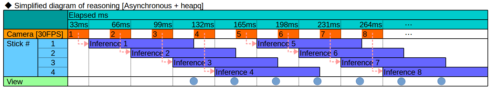
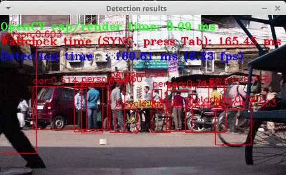
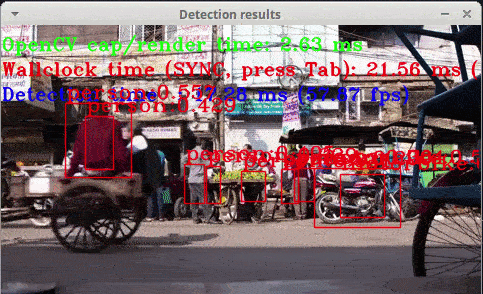
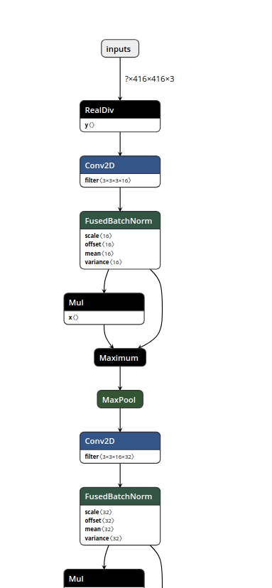

# OpenVINO-YoloV3
YoloV3 / tiny-YoloV3 + RaspberryPi3 / Ubuntu LaptopPC + NCS/NCS2 + USB Camera + Python
  
Inspired from **https://github.com/mystic123/tensorflow-yolo-v3.git**
  
**Performance comparison as a mobile application (Based on sensory comparison)**  
◯=HIGH, △=MEDIUM, ×=LOW  

|No.|Model|Speed|Accuracy|Adaptive distance|
|:-:|:-|:-:|:-:|:-|
|1|SSD|×|◯|ALL|
|2|**[MobileNet-SSD](https://github.com/PINTO0309/MobileNet-SSD-RealSense.git)**|△|△|Short distance|
|3|**[YoloV3](https://github.com/PINTO0309/OpenVINO-YoloV3.git)**|×|◯|ALL|
|4|**[tiny-YoloV3](https://github.com/PINTO0309/OpenVINO-YoloV3.git)**|◯|△|Long distance|

  


## My articles
1. [[24 FPS] Boost RaspberryPi3 with four Neural Compute Stick 2 (NCS2) MobileNet-SSD / YoloV3 [48 FPS for Core i7]](https://qiita.com/PINTO/items/94d5557fca9911cc892d#24-fps-boost-raspberrypi3-with-four-neural-compute-stick-2-ncs2-mobilenet-ssd--yolov3-48-fps-for-core-i7)
2. [[13 FPS] NCS2 x 4 + Full size YoloV3 performance has been tripled](https://qiita.com/PINTO/items/c766ac9614052f4d6304#13-fps-ncs2-x-4--full-size-yolov3-performance-has-been-tripled)

## Change history
[Mar 01, 2019]　Improve accuracy. Fixed preprocessing and postprocessing bug.

## Operation sample
**<CPP + YoloV3 - Intel Core i7-8750H, CPU Only, 4 FPS - 5 FPS>**  
[](https://youtu.be/vOcj_3ByK68)  
  
**<CPP + tiny-YoloV3 - Intel Core i7-8750H, CPU Only, 60 FPS>**  
[](https://youtu.be/md4udC4baZA)  

**<Python + tiny-YoloV3 + USBCamera, Core i7-8750H, CPU Only, 30 FPS>**  
[](https://youtu.be/HTDzpFFpBbc)  

**<Python + tiny-YoloV3 + Async + USBCamera, Core i7-8750H, NCS2, 30 FPS+>**  
**To raise the detection rate, lower the threshold by yourself.**  
**The default threshold is 40%.**  
[](https://youtu.be/7zkb413HCAs) 

**<Python + YoloV3 + MP4, Core i7-8750H, NCS2 x4, 13 FPS>  
【Note】 Due to the performance difference of ARM <-> Core series, performance is degraded in RaspberryPi3.**  
[](https://youtu.be/AT75LBIOAck)  
  
## Python Version YoloV3 / tiny-YoloV3 (Dec 28, 2018 Operation confirmed)
### YoloV3
```bash
$ python3 openvino_yolov3_test.py
```
### tiny-YoloV3 + NCS2 MultiStick
```bash
$ python3 openvino_tiny-yolov3_MultiStick_test.py -numncs 1
```
### YoloV3 + NCS2 MultiStick (Pretty slow)
```bash
$ python3 openvino_yolov3_MultiStick_test.py -numncs 4
```


## CPP Version YoloV3 / tiny-YoloV3 (Dec 16, 2018 Operation confirmed)
**[cpp version is here](cpp)** "cpp/object_detection_demo_yolov3_async"
  
## Environment

- LattePanda Alpha (Intel 7th Core m3-7y30) or LaptopPC (Intel 8th Core i7-8750H)
- Ubuntu 16.04 x86_64
- RaspberryPi3
- Raspbian Stretch armv7l
- OpenVINO toolkit 2018 R5 (2018.5.445)
- Python 3.5
- OpenCV 4.0.1-openvino
- Tensorflow v1.11.0 or Tensorflow-GPU v1.11.0 (pip install)
- YoloV3 (MS-COCO)
- tiny-YoloV3 (MS-COCO)
- USB Camera (PlaystationEye) / Movie file (mp4)
- Intel Neural Compute Stick v1 / v2
  
## OpenVINO Supported Layers (As of Dec 25, 2018)

- [Supported Framework Layers](https://docs.openvinotoolkit.org/R5/_docs_MO_DG_prepare_model_Supported_Frameworks_Layers.html)
- [Supported Caffe Layers](https://software.intel.com/en-us/articles/OpenVINO-Using-Caffe#caffe-supported-layers)
- [Supported TensorFlow Layers](https://software.intel.com/en-us/articles/OpenVINO-Using-TensorFlow#tensorflow-supported-layers)
- [Supported MXNet Layers](https://software.intel.com/en-us/articles/OpenVINO-Using-MXNet#mxnet-supported-layers)
- [Supported ONNX Layers](https://software.intel.com/en-us/articles/OpenVINO-Using-ONNX#supported-onnx-layers)

**Supported Devices (https://software.intel.com/en-us/articles/OpenVINO-InferEngine#inpage-nav-10-2)**
<table><tbody></tbody><thead><tr><th>Layers</th><th>GPU</th><th>CPU</th><th>MYRIAD</th><th>GNA</th><th>FPGA</th><th>ShapeInfer</th></tr></thead><tbody><tr><td>Activation-Clamp</td><td>Supported</td><td>Supported</td><td>Supported</td><td>Supported</td><td>Supported</td><td>Supported</td></tr><tr><td>Activation-ELU</td><td>Supported</td><td>Supported</td><td>Supported</td><td>Not Supported</td><td>Supported</td><td>Supported</td></tr><tr><td>Activation-Leaky ReLU</td><td>Supported</td><td>Not Supported</td><td>Supported</td><td>Supported</td><td>Supported</td><td>Supported</td></tr><tr><td>Activation-PReLU</td><td>Supported</td><td>Supported</td><td>Supported</td><td>Not Supported</td><td>Supported</td><td>Supported</td></tr><tr><td>Activation-ReLU</td><td>Supported</td><td>Supported</td><td>Supported</td><td>Supported</td><td>Supported</td><td>Supported</td></tr><tr><td>Activation-ReLU6</td><td>Supported</td><td>Supported</td><td>Supported</td><td>Not Supported</td><td>Not Supported</td><td>Supported</td></tr><tr><td>Activation-Sigmoid/Logistic</td><td>Supported</td><td>Supported</td><td>Supported</td><td>Supported</td><td>Not Supported</td><td>Supported</td></tr><tr><td>Activation-TanH</td><td>Supported</td><td>Supported</td><td>Supported</td><td>Supported</td><td>Not Supported</td><td>Supported</td></tr><tr><td>ArgMax</td><td>Supported</td><td>Supported</td><td>Not Supported</td><td>Not Supported</td><td>Not Supported</td><td>Supported</td></tr><tr><td>BatchNormalization</td><td>Supported</td><td>Supported</td><td>Supported</td><td>Not Supported</td><td>Supported</td><td>Supported</td></tr><tr><td>Concat</td><td>Supported</td><td>Supported</td><td>Supported</td><td>Not Supported</td><td>Supported</td><td>Supported</td></tr><tr><td>Const</td><td>Supported</td><td>Supported</td><td>Supported</td><td>Not Supported</td><td>Not Supported</td><td>Not Supported</td></tr><tr><td>Convolution-Dilated</td><td>Supported</td><td>Supported</td><td>Supported</td><td>Supported</td><td>Not Supported</td><td>Supported</td></tr><tr><td>Convolution-Grouped</td><td>Supported</td><td>Supported</td><td>Supported</td><td>Not Supported</td><td>Supported</td><td>Supported</td></tr><tr><td>Convolution-Ordinary</td><td>Supported</td><td>Supported</td><td>Supported</td><td>Supported</td><td>Supported</td><td>Supported</td></tr><tr><td>Crop</td><td>Supported</td><td>Supported</td><td>Supported</td><td>Not Supported</td><td>Not Supported</td><td>Supported</td></tr><tr><td>CTCGreedyDecoder</td><td>Supported</td><td>Supported</td><td>Supported</td><td>Not Supported</td><td>Not Supported</td><td>Supported</td></tr><tr><td>Deconvolution</td><td>Supported</td><td>Supported</td><td>Supported</td><td>Not Supported</td><td>Supported</td><td>Supported</td></tr><tr><td>DetectionOutput</td><td>Supported</td><td>Supported</td><td>Supported</td><td>Not Supported</td><td>Not Supported</td><td>Supported</td></tr><tr><td>Eltwise-Max</td><td>Supported</td><td>Supported</td><td>Supported</td><td>Not Supported</td><td>Not Supported</td><td>Supported</td></tr><tr><td>Eltwise-Mul</td><td>Supported</td><td>Supported</td><td>Supported</td><td>Supported</td><td>Not Supported</td><td>Supported</td></tr><tr><td>Eltwise-Sum</td><td>Supported</td><td>Supported</td><td>Supported</td><td>Supported</td><td>Supported</td><td>Supported</td></tr><tr><td>Flatten</td><td>Supported</td><td>Supported</td><td>Supported</td><td>Not Supported</td><td>Not Supported</td><td>Supported</td></tr><tr><td>FullyConnected (Inner Product)</td><td>Supported</td><td>Supported</td><td>Supported</td><td>Supported</td><td>Supported</td><td>Supported</td></tr><tr><td>GRN</td><td>Supported</td><td>Supported</td><td>Supported</td><td>Not Supported</td><td>Not Supported</td><td>Supported</td></tr><tr><td>Interp</td><td>Supported</td><td>Supported</td><td>Supported</td><td>Not Supported</td><td>Not Supported</td><td>Supported</td></tr><tr><td>LRN (Norm)</td><td>Supported</td><td>Supported</td><td>Supported</td><td>Not Supported</td><td>Supported</td><td>Supported</td></tr><tr><td>Memory</td><td>Not Supported</td><td>Supported</td><td>Not Supported</td><td>Supported</td><td>Not Supported</td><td>Supported</td></tr><tr><td>MVN</td><td>Supported</td><td>Supported</td><td>Supported</td><td>Not Supported</td><td>Not Supported</td><td>Supported</td></tr><tr><td>Normalize</td><td>Supported</td><td>Supported</td><td>Supported</td><td>Not Supported</td><td>Not Supported</td><td>Supported</td></tr><tr><td>Permute</td><td>Supported</td><td>Supported</td><td>Supported</td><td>Not Supported</td><td>Not Supported</td><td>Supported</td></tr><tr><td>Pooling(AVG,MAX)</td><td>Supported</td><td>Supported</td><td>Supported</td><td>Supported</td><td>Supported</td><td>Supported</td></tr><tr><td>Power</td><td>Supported</td><td>Supported</td><td>Supported</td><td>Not Supported</td><td>Supported</td><td>Supported</td></tr><tr><td>PriorBox</td><td>Supported</td><td>Supported</td><td>Supported</td><td>Not Supported</td><td>Not Supported</td><td>Supported</td></tr><tr><td>PriorBoxClustered</td><td>Supported</td><td>Supported</td><td>Supported</td><td>Not Supported</td><td>Not Supported</td><td>Supported</td></tr><tr><td>Proposal</td><td>Supported</td><td>Supported</td><td>Supported</td><td>Not Supported</td><td>Not Supported</td><td>Supported</td></tr><tr><td>PSROIPooling</td><td>Supported</td><td>Supported</td><td>Supported</td><td>Not Supported</td><td>Not Supported</td><td>Supported</td></tr><tr><td>RegionYolo</td><td>Supported</td><td>Supported</td><td>Supported</td><td>Not Supported</td><td>Not Supported</td><td>Supported</td></tr><tr><td>ReorgYolo</td><td>Supported</td><td>Supported</td><td>Supported</td><td>Not Supported</td><td>Not Supported</td><td>Supported</td></tr><tr><td>Resample</td><td>Supported</td><td>Supported</td><td>Supported</td><td>Not Supported</td><td>Not Supported</td><td>Supported</td></tr><tr><td>Reshape</td><td>Supported</td><td>Supported</td><td>Supported</td><td>Supported</td><td>Not Supported</td><td>Supported</td></tr><tr><td>ROIPooling</td><td>Supported</td><td>Supported</td><td>Supported</td><td>Supported</td><td>Not Supported</td><td>Supported</td></tr><tr><td>Scale</td><td>Not Supported</td><td>Not Supported</td><td>Supported</td><td>Not Supported</td><td>Not Supported</td><td>Not Supported</td></tr><tr><td>ScaleShift</td><td>Supported</td><td>Supported</td><td>Supported</td><td>Supported</td><td>Supported</td><td>Supported</td></tr><tr><td>SimplerNMS</td><td>Supported</td><td>Supported</td><td>Not Supported</td><td>Not Supported</td><td>Not Supported</td><td>Supported</td></tr><tr><td>Slice</td><td>Supported</td><td>Supported</td><td>Supported</td><td>Supported</td><td>Supported</td><td>Supported</td></tr><tr><td>SoftMax</td><td>Supported</td><td>Supported</td><td>Supported</td><td>Not Supported</td><td>Not Supported</td><td>Supported</td></tr><tr><td>SpatialTransformer</td><td>Not Supported</td><td>Supported</td><td>Not Supported</td><td>Not Supported</td><td>Not Supported</td><td>Supported</td></tr><tr><td>Split</td><td>Supported</td><td>Supported</td><td>Supported</td><td>Supported</td><td>Supported</td><td>Supported</td></tr><tr><td>Tile</td><td>Supported</td><td>Supported</td><td>Supported</td><td>Not Supported</td><td>Not Supported</td><td>Supported</td></tr><tr><td>Unpooling</td><td>Supported</td><td>Not Supported</td><td>Not Supported</td><td>Not Supported</td><td>Not Supported</td><td>Not Supported</td></tr><tr><td>Upsampling</td><td>Supported</td><td>Not Supported</td><td>Not Supported</td><td>Not Supported</td><td>Not Supported</td><td>Not Supported</td></tr></tbody></table>
  
## OpenVINO - Python API
**https://software.intel.com/en-us/articles/OpenVINO-InferEngine#inpage-nav-9**
  
<br>
<br>

# Environment construction procedure
### 1. Work with LaptopPC (Ubuntu 16.04)
1.OpenVINO R5 Full-Install. Execute the following command.
```bash
$ cd ~
$ curl -sc /tmp/cookie "https://drive.google.com/uc?export=download&id=1tlDW_kDOchWbkZbfy5WfbsW-b_GpXgr7" > /dev/null
$ CODE="$(awk '/_warning_/ {print $NF}' /tmp/cookie)"
$ curl -Lb /tmp/cookie "https://drive.google.com/uc?export=download&confirm=${CODE}&id=1tlDW_kDOchWbkZbfy5WfbsW-b_GpXgr7" -o l_openvino_toolkit_p_2018.5.445.tgz
$ tar -zxf l_openvino_toolkit_p_2018.5.445.tgz
$ rm l_openvino_toolkit_p_2018.5.445.tgz
$ cd l_openvino_toolkit_p_2018.5.445
$ sudo -E ./install_cv_sdk_dependencies.sh

## GUI version installer
$ sudo ./install_GUI.sh
 or
## CUI version installer
$ sudo ./install.sh
```
2.Configure the Model Optimizer. Execute the following command.
```bash
$ cd /opt/intel/computer_vision_sdk/install_dependencies
$ sudo -E ./install_cv_sdk_dependencies.sh
$ nano ~/.bashrc
source /opt/intel/computer_vision_sdk/bin/setupvars.sh

$ source ~/.bashrc
$ cd /opt/intel/computer_vision_sdk/deployment_tools/model_optimizer/install_prerequisites
$ sudo ./install_prerequisites.sh
```
3.【Optional execution】 Additional installation steps for the Intel® Movidius™ Neural Compute Stick v1 and Intel® Neural Compute Stick v2
```bash
$ sudo usermod -a -G users "$(whoami)"
$ cat <<EOF > 97-usbboot.rules
SUBSYSTEM=="usb", ATTRS{idProduct}=="2150", ATTRS{idVendor}=="03e7", GROUP="users", MODE="0666", ENV{ID_MM_DEVICE_IGNORE}="1"
SUBSYSTEM=="usb", ATTRS{idProduct}=="2485", ATTRS{idVendor}=="03e7", GROUP="users", MODE="0666", ENV{ID_MM_DEVICE_IGNORE}="1"
SUBSYSTEM=="usb", ATTRS{idProduct}=="f63b", ATTRS{idVendor}=="03e7", GROUP="users", MODE="0666", ENV{ID_MM_DEVICE_IGNORE}="1"
EOF

$ sudo cp 97-usbboot.rules /etc/udev/rules.d/
$ sudo udevadm control --reload-rules
$ sudo udevadm trigger
$ sudo ldconfig
$ rm 97-usbboot.rules
```
4.【Optional execution】 Additional installation steps for processor graphics (GPU)
```bash
$ cd /opt/intel/computer_vision_sdk/install_dependencies/
$ sudo -E su
$ uname -r
4.15.0-42-generic #<--- display kernel version sample

### Execute only when the kernel version is older than 4.14
$ ./install_4_14_kernel.sh

$ ./install_NEO_OCL_driver.sh
$ sudo reboot
```

### 2. Work with RaspberryPi (Raspbian Stretch)
**[Note] Only the execution environment is introduced.**  
  
1.Execute the following command.
```bash
$ sudo apt update
$ sudo apt upgrade
$ curl -sc /tmp/cookie "https://drive.google.com/uc?export=download&id=1rBl_3kU4gsx-x2NG2I5uIhvA3fPqm8uE" > /dev/null
$ CODE="$(awk '/_warning_/ {print $NF}' /tmp/cookie)"
$ curl -Lb /tmp/cookie "https://drive.google.com/uc?export=download&confirm=${CODE}&id=1rBl_3kU4gsx-x2NG2I5uIhvA3fPqm8uE" -o l_openvino_toolkit_ie_p_2018.5.445.tgz
$ tar -zxvf l_openvino_toolkit_ie_p_2018.5.445.tgz
$ rm l_openvino_toolkit_ie_p_2018.5.445.tgz
$ sed -i "s|<INSTALLDIR>|$(pwd)/inference_engine_vpu_arm|" inference_engine_vpu_arm/bin/setupvars.sh
```
2.Execute the following command.
```bash
$ nano ~/.bashrc
### Add 1 row below
source /home/pi/inference_engine_vpu_arm/bin/setupvars.sh

$ source ~/.bashrc
### Successful if displayed as below
[setupvars.sh] OpenVINO environment initialized

$ sudo usermod -a -G users "$(whoami)"
$ sudo reboot
```
3.Update USB rule.
```bash
$ sh inference_engine_vpu_arm/install_dependencies/install_NCS_udev_rules.sh
### It is displayed as follows
Update udev rules so that the toolkit can communicate with your neural compute stick
[install_NCS_udev_rules.sh] udev rules installed
```
**[Note] OpenCV 4.0.1 will be installed without permission when the work is finished.
If you do not want to affect other environments, please edit environment variables after installation is completed.**
<br>
<br>
<br>
<br>

# How to install Bazel (version 0.17.2, x86_64 only)
### 1. Bazel introduction command
```bash
$ cd ~
$ curl -sc /tmp/cookie "https://drive.google.com/uc?export=download&id=1dvR3pdM6vtkTWqeR-DpgVUoDV0EYWil5" > /dev/null
$ CODE="$(awk '/_warning_/ {print $NF}' /tmp/cookie)"
$ curl -Lb /tmp/cookie "https://drive.google.com/uc?export=download&confirm=${CODE}&id=1dvR3pdM6vtkTWqeR-DpgVUoDV0EYWil5" -o bazel
$ sudo cp ./bazel /usr/local/bin
$ rm ./bazel
```
### 2. Supplementary information
**https://github.com/PINTO0309/Bazel_bin.git**

# How to check the graph structure of a ".pb" file [Part.1]
Simple structure analysis.
### 1. Build and run graph structure analysis program
```bash
$ cd ~
$ git clone -b v1.11.0 https://github.com/tensorflow/tensorflow.git
$ cd tensorflow
$ git checkout -b v1.11.0
$ bazel build tensorflow/tools/graph_transforms:summarize_graph
$ bazel-bin/tensorflow/tools/graph_transforms/summarize_graph --in_graph=xxxx.pb
```
### 2. Sample of display result
YoloV3
```bash
Found 1 possible inputs: (name=inputs, type=float(1), shape=[?,416,416,3]) 
No variables spotted.
Found 1 possible outputs: (name=output_boxes, op=ConcatV2) 
Found 62002034 (62.00M) const parameters, 0 (0) variable parameters, and 0 control_edges
Op types used: 536 Const, 372 Identity, 87 Mul, 75 Conv2D, 72 FusedBatchNorm, 72 Maximum, 28 Add, \
24 Reshape, 14 ConcatV2, 9 Sigmoid, 6 Tile, 6 Range, 5 Pad, 4 SplitV, 3 Pack, 3 RealDiv, 3 Fill, \
3 Exp, 3 BiasAdd, 2 ResizeNearestNeighbor, 2 Sub, 1 Placeholder
To use with tensorflow/tools/benchmark:benchmark_model try these arguments:
bazel run tensorflow/tools/benchmark:benchmark_model -- \
--graph=/home/b920405/git/OpenVINO-YoloV3/pbmodels/frozen_yolo_v3.pb \
--show_flops \
--input_layer=inputs \
--input_layer_type=float \
--input_layer_shape=-1,416,416,3 \
--output_layer=output_boxes
```
tiny-YoloV3
```bash
Found 1 possible inputs: (name=inputs, type=float(1), shape=[?,416,416,3]) 
No variables spotted.
Found 1 possible outputs: (name=output_boxes, op=ConcatV2) 
Found 8858858 (8.86M) const parameters, 0 (0) variable parameters, and 0 control_edges
Op types used: 134 Const, 63 Identity, 21 Mul, 16 Reshape, 13 Conv2D, 11 FusedBatchNorm, 11 Maximum, \
10 ConcatV2, 6 Sigmoid, 6 MaxPool, 4 Tile, 4 Add, 4 Range, 3 RealDiv, 3 SplitV, 2 Pack, 2 Fill, \
2 Exp, 2 Sub, 2 BiasAdd, 1 Placeholder, 1 ResizeNearestNeighbor
To use with tensorflow/tools/benchmark:benchmark_model try these arguments:
bazel run tensorflow/tools/benchmark:benchmark_model -- \
--graph=/home/b920405/git/OpenVINO-YoloV3/pbmodels/frozen_tiny_yolo_v3.pb \
--show_flops \
--input_layer=inputs \
--input_layer_type=float \
--input_layer_shape=-1,416,416,3 \
--output_layer=output_boxes
```

# How to check the graph structure of a ".pb" file [Part.2]
Convert to text format.
### 1. Run graph structure analysis program
```bash
$ python3 tfconverter.py
### ".pbtxt" in ProtocolBuffer format is output.
### The size of the generated text file is huge.
```

# How to check the graph structure of a ".pb" file [Part.3]
Use Tensorboard.
### 1. Run log output program for Tensorboard
```python
import tensorflow as tf
from tensorflow.python.platform import gfile

with tf.Session() as sess:
    model_filename ="xxxx.pb"
    with gfile.FastGFile(model_filename, "rb") as f:
        graph_def = tf.GraphDef()
        graph_def.ParseFromString(f.read())
        g_in = tf.import_graph_def(graph_def)

    LOGDIR="path/to/logs"
    train_writer = tf.summary.FileWriter(LOGDIR)
    train_writer.add_graph(sess.graph)
```
### 2. Starting Tensorboard
```bash
$ tensorboard --logdir=path/to/logs
```
### 3. Display of Tensorboard
Access `http://localhost:6006` from the browser.
  
# How to check the graph structure of a ".pb" file [Part.4]
Use **[netron](https://github.com/lutzroeder/netron.git)**.
### 1. Install netron
```bash
$ sudo -H pip3 install netron
```
### 2. Starting netron
```bash
$ netron -b [MODEL_FILE]
```
### 3. Display of netron
Access `http://localhost:8080` from the browser.  

# Neural Compute Stick 2
**https://ncsforum.movidius.com/discussion/1302/intel-neural-compute-stick-2-information**

# Issue
**[OpenVINO failing on YoloV3's YoloRegion, only one working on FP16, all working on FP32](https://software.intel.com/en-us/forums/computer-vision/topic/804019)**

# Reference
**https://github.com/opencv/opencv/wiki/Intel%27s-Deep-Learning-Inference-Engine-backend**
**https://github.com/opencv/opencv/wiki/Intel%27s-Deep-Learning-Inference-Engine-backend#raspbian-stretch**
